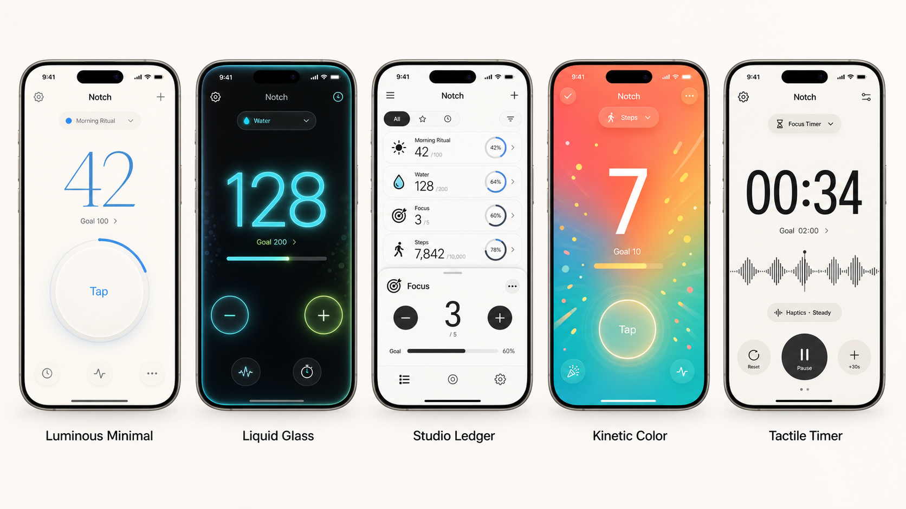

# Notch for iOS

Notch is a polished, customizable iOS counter app designed around fast daily rituals, focused progress tracking, countdown feedback, and expressive visual themes.

This public repository is a portfolio showcase only. It intentionally does not include source code, project files, build artifacts, app binaries, private assets, signing materials, or install instructions because the app is planned for commercial release on the App Store.

## Product Summary

Notch turns simple counting into a more tactile, personal experience. The app supports lightweight counters for habits and rituals, goal tracking, countdown-style timers, haptic feedback patterns, alternate app icons, and multiple UI styles.

## Design Direction

The app explores five distinct interface concepts:

- **Luminous Minimal**: quiet, airy, goal-focused counting with a soft circular tap target.
- **Liquid Glass**: dark, neon, high-contrast interaction with glowing numeric feedback.
- **Studio Ledger**: a dense list-and-detail interface for tracking multiple counters quickly.
- **Kinetic Color**: celebratory, high-energy visuals for movement and streak-like use cases.
- **Tactile Timer**: timer-first layout with monospaced numerals, waveform detail, and haptic controls.

## My Role

I designed and built the iOS app experience end to end, including:

- SwiftUI application architecture
- Counter data model and persistence
- Customizable themes and visual systems
- Goal progress and countdown interactions
- Haptic feedback flows
- Alternate app icon support
- StoreKit-backed unlock flow
- App icon design integration
- Simulator build validation

## Technical Highlights

- Native SwiftUI interface
- iOS 17 target
- Local persistence with `UserDefaults`
- StoreKit product configuration for unlock testing
- Custom theme system with reusable typography, color, and layout primitives
- Modular editor/settings sheets for counter customization
- Build verified with Xcode for iOS Simulator

## Source Availability

The source code is private while the app is prepared for commercial release.

Employers or collaborators who need to review implementation details can request a private walkthrough, live demo, or temporary repository access.

## Status

Private beta / App Store preparation.
